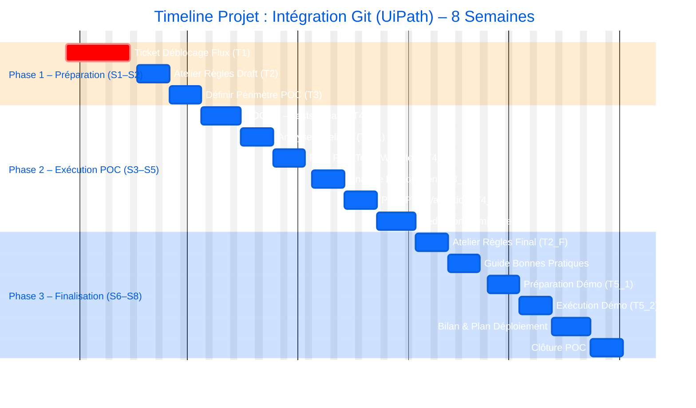

Schéma du Projet : Intégration Git (UiPath) & Automation Ops

Voici une représentation visuelle de la timeline du projet sous forme de diagramme de Gantt.

Explication de la lecture :

Le diagramme est basé sur une durée en jours (7 jours = 1 semaine).

L'axe horizontal représente le nombre de jours depuis le début du projet (0, 7, 14... jusqu'à 56).

Phase 1 couvre les 2 premières semaines (jours 0-14).

Phase 2 couvre les 3 semaines suivantes (jours 14-35).

Phase 3 couvre les 3 dernières semaines (jours 35-56).

Le "Ticket Déblocage Flux" est marqué comme "critique" (crit) car beaucoup d'autres tâches en dépendent.